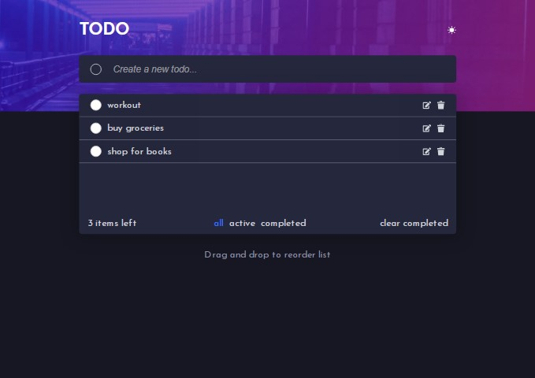

# Frontend Mentor - Todo app solution

## Table of contents

- [Overview](#overview)
  - [Screenshot](#screenshot)
  - [Links](#links)
- [My process](#my-process)
  - [Built with](#built-with)
  - [What I learned](#what-i-learned)
- [Author](#author)

## Overview

### Screenshot



### Links

- Solution URL: [Add solution URL here](https://your-solution-url.com)
- Live Site URL: [Add live site URL here](https://your-live-site-url.com)

## My process

### Built with

- Flexbox
- SCSS
- Laptop-first workflow
- [React](https://reactjs.org/) - JS library

### What I learned

I learnt how to use react drag and drop, It's an amazing feature.

```reactJs
  listItems = allTodos.map((todo, index) => (
      <Draggable key={todo.id} draggableId={todo.id} index={index}>
        {(provided, snapshot) => (
          <li
            ref={provided.innerRef}
            {...provided.draggableProps}
            {...provided.dragHandleProps}
          >
            <TodoItem
              todoItem={todo.text}
              id={todo.id}
              checked={todo.checked}
            />
          </li>
        )}
      </Draggable>
    ));
  }
```

## Author

- Frontend Mentor - [@ejim11](https://www.frontendmentor.io/profile/ejim11)
- Twitter - [@favourejim56](https://www.twitter.com/favourejim56)
